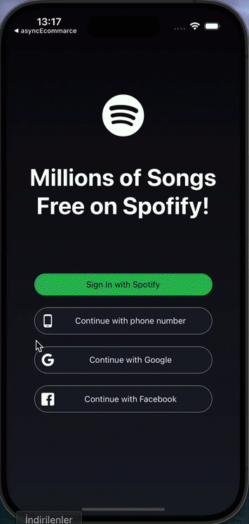

# Spotify Clone

This project is a Spotify Clone built using React Native. It allows users to play music, browse tracks, and manage their playlists. The app uses various features such as authentication, track player functionality, and context management to replicate the Spotify experience.

## Features

- **Authentication**: User login functionality using OAuth for secure access.
- **Track Player**: Ability to play, pause, and skip tracks.
- **Browse Tracks**: Users can browse through tracks and albums, mimicking Spotify's browsing experience.
- **Context API**: Centralized state management using React's Context API.
- **Music Playback**: Integration of `react-native-track-player` for smooth music playback.
- **Responsive UI**: Built with a responsive layout for an optimal user experience on various screen sizes.

## Technologies Used

- **React Native**: Framework for building native mobile apps.
- **Axios**: For making API requests to fetch music data.
- **React Navigation**: For navigation between screens in the app.
- **React Context API**: For global state management.
- **React-native-track-player**: For handling music playback.
- **React-native-sound**: For sound management in the app.
- **React-native-async-storage**: To store user data locally.
- **React-native-modal**: For displaying modal windows for additional features.

# rn-spotify-clone
